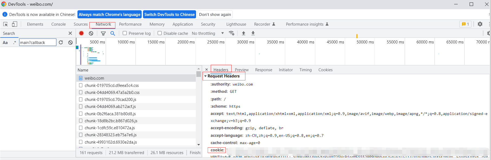

# covid-analysis-visualization
含疫情官方数据爬虫、对微博主题关键词“疫情”爬虫（数据库）、对爬取数据的预处理及可视化，对微博疫情数据情感分析（含关于疫情的微博评论正负面语料）

# Readme
是本科阶段的课程作业之一，可以参考以下:

· 人工智能实践课

· 包含对每日疫情数据的爬取、疫情历史数据的爬取（均未设置自动爬取时间）及可视化处理 （pyechart）

· 包含对微博关键词为“#疫情#”的自动爬取，一天大概上万条数据，具体设置参数详见另一篇文档，我选择的是mysql数据库、不下载视频图片、时间日期2022-03-01~2022-03-20，如果需要重新爬取建议参见另一篇文档/直接更改cookie （使用自己的微博cookie）
### 如何获取cookie？
1.建议用chrome打开https://weibo.com/

2.登录微博，刷新一下

3.F12开发者工具—— Network->Name->weibo.cn->Headers->Request Headers, 找到"Cookie:"后的值, 这就是我们要找的cookie值, 复制。

### 文档与目录结构
- DataSets 

nCoV_100k_train.labled 有十万条已经打标签的数据，数据来源于kaggle竞赛

weibo.json 微博评论数据

positive.txt & negative.txt 用于snownlp的情感分析模块自定义训练

### 微博情感分析
首先尝试了基于词典/句法结构的文本情感分析

· 情感字典

除了分词词典和停用词词典以外，一般还包括：否定词、正面情感词、负面情感词、程度词

利用loaddict函数载入情感词否定词和程度词，数据结构为字典 key为情感词 值为分值,ScoreSent 函数是利用三个词典 然后加权赋值 最后得出一个情感值,其中情感词典里我们新增加了关于疫情方面的关键词抽取,利用的是jieba分词的基于tf-idf算法/textrank算法

算法逻辑实现（部分）：

1：读取评论数据，对评论进行分句（分句主要以特定的标点符号为主）。

2：将结巴词典和所有情感词典做并集，得出新的分词词典。

3：查找分句的情感词，记录正面还是负面，以及位置。

4：在情感词前查找程度词，找到就停止搜寻。为程度词设权值，乘以情感值。

5：在情感词前查找否定词，找完全部否定词，若数量为奇数，乘以-1，若为偶数， 乘以 1。

